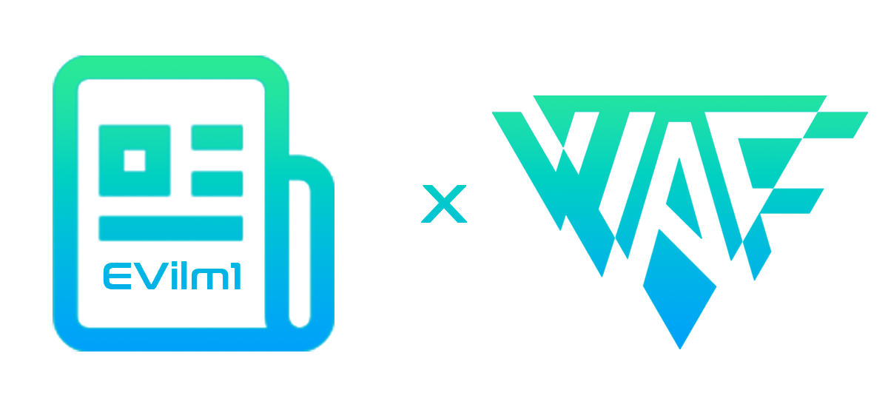
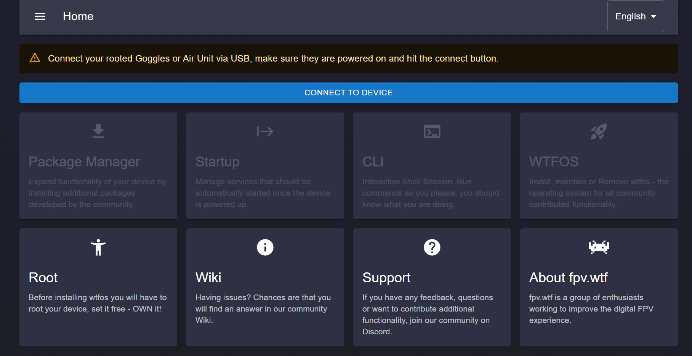
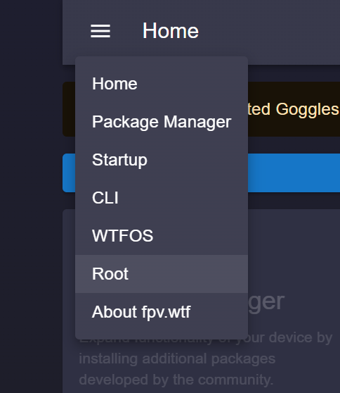
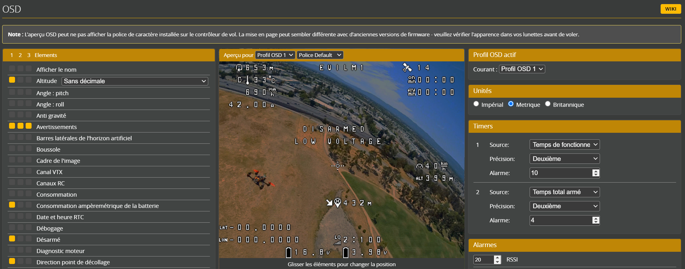

<a name="readme-top"></a>

<!-- PROJECT SHIELDS -->
<!--
*** I'm using markdown "reference style" links for readability.
*** Reference links are enclosed in brackets [ ] instead of parentheses ( )
*** See the bottom of this document for the declaration of the reference variables
*** for contributors-url, forks-url, etc. This is an optional, concise syntax you may use.
*** https://www.markdownguide.org/basic-syntax/#reference-style-links
-->
[](https://discord.gg/4q5srBqn89)
[](https://code.visualstudio.com/)
[](https://www.python.org/downloads)
[](https://www.adobe.com/fr/products/photoshop.html)
[](https://forum.xda-developers.com/)
[]()


<!-- PROJECT LOGO -->
<br />
<div align="center">
  <a href="https://github.com/EVilm1/doc-DJI-Hack">
    
  </a>

  <h3 align="center">WIKI HACK OSD DJI</h3>

  <p align="center">
    ✨ Personnalisez votre OSD ✨
    <br />
    <br />
    <a href="https://github.com/fpv-wtf/wtfos"><strong>Wiki WTFOS</strong></a>
    ·
    <a href="https://github.com/fpv-wtf/msp-osd"><strong>Wiki MSP-OSD</strong></a>
    ·
    <a href="https://fpv.wtf/"><strong>WTFOS Configurator</strong></a>
  </p>
</div>


<!-- TABLE OF CONTENTS -->

<details>
  <summary>Table of Contents</summary>
  <ol>
    <li><a href="#Intro">Intro</a>
      <ul>
        <li><a href="#Exemple">Exemple</a></li>
      </ul>
    </li>
  </ol>
  <ol>
    <li><a href="#1-installer-wtfos">Installer WTFOS</a>
      <ul>
        <li><a href="#configurer-les-ports">Configurer les ports</a></li>
      </ul>
    </li>
    <li><a href="#2-déplacer-les-élements-de-msp-osd">Déplacer les élements de MSP-OSD</a></li>
    <li><a href="#3-fakehd">FakeHD</a></li>
      <ul>
        <li><a href="#activer-et-configurer-fakehd">Activer et configurer FakeHD</a></li>
      </ul>
    </li>
    <li><a href="#4-splashscreen--screensaver-wtfos">Splashscreen & Screensaver WTFOS</a></li>
    <li><a href="5-les-fonts-msp-osd">Les Fonts MSP-OSD</a></li>
    <li> <a href="#6-config-avancée--modifier-les-éléments-de-lhud-dji">(Config avancée) : Modifier les éléments de l'HUD DJI</a>
      <ul>
        <li><a href="#modifier-lemplacement-des-éléments-de-lhud-dji">Modifier l'emplacement des éléments de l'HUD DJI</a></li>
          <ul>
            <li><a href="#prévisualisation-script-python">Prévisualisation script Python</a></li>
            <li><a href="#modifier-le-fichier-xml">Modifier le fichier .xml</a></li>
          </ul>
        <li><a href="#modifier-la-police-de-lhud-dji">Modifier la police de l'HUD DJI</a></li>
        <li><a href="#modifier-les-icones-de-lhud-dji">Modifier les icones de l'HUD DJI</a></li>
      </ul>
    </li>
    <li><a href="#7-config-avancée-générer-sa-propre-font-pour-msp-osd">(Config avancée) Générer sa propre Font pour MSP-OSD</a></li>
  </ol>
</details>


<!-- INTRO -->
# Intro

Cette documentation explique en détails comment modifier votre OSD dans votre masque DJI.
Les exemples suivants seront réalisés avec le combo **DJI Googles V2 / Betaflight**.

Pour poser les bases, il faut bien différencier les termes suivants :
* **``OSD Betaflight :``** C'est l'osd classique à la sortie de Betaflight, c'est celui que l'on retrouve généralement dans des lunettes analogiques.
* **``HUD DJI / CUSTOM OSD :``** Comme l'osd Betaflight, mais traduis par DJI, c'est l'osd par défaut des DJI Googles. Cette fonctionnalité porte également le nom de "Custom OSD" dans les paramètres du masque et présente des défauts car n'utilise pas à 100% les infos reçues   de Betaflight.
* **``WTFOS MSP-OSD :``** Le package MSP-OSD est installé grâce au hack WTFOS, il remplace le HUD DJI et permet de nouvelles fonctionnalités.

<!-- EXEMPLE -->
## Exemple

Nous allons donc faire un mix entre **``MSP-OSD``** pour toutes les infos à la sortie de Betaflight et le **``HUD DJI``** pour toutes les autres infos qui ne sortent pas de Betaflight (Ex : La batterie du masque, la qualité du lien VTX, la latence VTX...)

Nous verrons également comment modifier l'emplacement des éléments du HUD DJI, modifier la police du HUD DJI, créer une nouvelle police pour MSP-OSD... 

Voici un exemple avant/après de ce qu'il est possible de faire :<br />
| Avant (**HUD DJI**) | Après (**MSP-OSD + FakeHD + HUD DJI Custom + Fonts Custom**) |
|-------|-------|
|||


ℹ️ Les infos ici relèvent de ma propre expérience, toutes les <a href="#readme-top">sources</a> sont citées en haut du doc.<br />
⚠️ Les manipulations peuvent comporter des risques (infimes si correctement réalisés), vous êtes les seuls responsables des agissements sur votre matériel.

<!-- INSTALL WTFOS -->
# 1. Installer WTFOS

Avant toute manipulation, le masque doit être rooté, pour cela **WTFOS** doit être installé à l'aide de [WTFOS-Configurator](https://fpv.wtf/), tout est très bien expliqué dans [la doc officielle](https://github.com/fpv-wtf/wtfos) de fpv-wtf. Je vous conseille de chercher des tutos sur Youtube.

|||
|-------|-------|

⚠️ **IMPORTANT :** Avant de rooter le masque, assurez-vous que le masque et le VTX (Vista/AirUnit) sont dans la même version.<br />

Le logiciel [DJI Assistant 2 FPV](https://www.dji.com/fr/downloads/softwares/dji-assistant-2-dji-fpv-series) permet de checker la version, upgrade ou downgrade le firmware du masque et du VTX. La version **``v01.00.06.06``** dites **``"606"``** est la plus utilisée et celle qui convient le mieux.

<!-- SERIALPORTS CONFIG -->
## Configurer les ports
Une fois le masque rooté il faut configurer les ports sur Betaflight. Exécuter ce code dans le ``CLI`` de **BetaFlight-Configurator** :
```
set osd_displayport_device = MSP
set displayport_msp_serial = $
set vcd_video_system = PAL
save
```
*Avec ``$``, le numéro de port VTX **- 1**.<br /> Exemple : le VTX est sur ``UART1``, donc ``displayport_msp_serial = 0``.*

<!-- MOVE MSP-OSD -->
# 2. Déplacer les élements de MSP-OSD

Une fois **MSP-OSD** installé (avec ports configurés sur Betaflight) nous pouvons maintenant désactiver le ``"Custom OSD"`` du masque DJI dans :
```
Settings > Display > Custom OSD : off
```
Nous avons maintenant l'OSD complet de Betaflight débloqué. Nous pouvons ajouter / supprimer / changer l'emplacement des éléments directement depuis la section ``OSD`` dans Betaflight :



Nous remarquons que l'OSD Betaflight est obligatoirement dans un format 4:3. Peu importe le format que vous avez choisi pour votre VTX (4:3 ou 16:9) Betaflight ne peut pas afficher un osd plus large que le 4:3. Pour cela il existe une solution du nom de ``FakeHD`` grâce à WTFOS que nous allons détailler dans la section suivante.

<!-- FAKEHD -->
# 3. FakeHD

``FakeHD`` est une solution pour afficher notre OSD dans un format 16:9. Pour comprendre comment le configurer il faut comprendre son fonctionnement :<br/>
L'OSD Betaflight est une grille de 30 lignes et 16 colonnes. Il est impossible de "rajouter" des cases pour étirer le format 4:3 vers un format 16:9. Pour contourner ce probleme, ``FakeHD`` permet de déplacer des "blocs" du format 4:3 pour en faire un format 16:9.<br/>
Explications pas très claires, schéma plus simple :

| Avant (dans Betaflight Configurator) | Après avec ``FakeHD`` (dans le masque) |
| -------|-------|
|||

Sur le schéma on voit les cases de couleur déplacées dans les angles et sur les côtés, mais il y a aussi des cases entièrement blanches. Comme dit plus haut, il est impossible de "rajouter" des cases, ces cases sont donc vides et il est impossible d'afficher des caractères dans les zones blanches.

Exemple simple pour mieux comprendre :
| J'affiche l'élément "Avertissements" de Betaflight mal centré comme ceci :  | Résultat ``FakeHD`` |
| -------|-------|
|||

C'est un peu bizarre et il faut le prendre en compte quand on place les éléments dans Betaflight.<br/>
Pour plus d'infos et de paramètres n'hésitez pas à vous rendre sur la [doc officielle de FakeHD](https://github.com/fpv-wtf/msp-osd#fakehd).

<!-- INSTALL FAKEHD -->
## Activer et configurer **FakeHD**

Pour activer ``FakeHD``, on connecte le masque à WTFOS [Configurator](https://fpv.wtf/), dans le ``CLI`` on exécute :

```
package-config set msp-osd fakehd_enable true
package-config apply msp-osd
```
C'est fini ``FakeHD`` est activé !<br/>

Malheureusement ça serait trop simple, en effet, à cause de l'exemple du texte coupé vu juste avant, l'écran de fin de vol (les stats) ne peut pas s'afficher correctement. Pour corriger ça, ``FakeHD`` est capable de s'activer pour le vol et se désactiver pour l'écran de fin grâce à un "caractère switch" (Si le caractère s'affiche à l'écran alors ``FakeHD`` s'active, sinon il se désactive).<br/>
Ce "caractère switch" est paramétré par défaut sur le caractère "Thottle icon". Si vous ne voulez pas afficher ce caractère ou souhaitez changer, je vous laisse consulter [la doc](https://github.com/fpv-wtf/msp-osd#menu-switching---getting-rid-of-gaps-when-displaying-menu--post-flight-stats--displaying-centered) qui explique ça très bien.

<!-- WTFOS SPLASHSCREEN -->
# 4. Splashscreen & Screensaver WTFOS
Grâce à WTFOS nous pouvons changer l'écran de fond par défaut du masque DJI. pour cela nous devons avoir installé dans le [WTFOS-Configurator](https://fpv.wtf/) les packages ``image-changer`` et ``image-configurator`` :


Ensuite nous pouvons laisser le fond de WTFOS ou ajouter un fond personnalisé nommé ``splashscreen.png`` à placer à la racine de la carte SD du masque DJI.
Le format optimal est ``1920x1080``. Plus l'image est grande, plus votre masque est lent au démarrage !

<!-- MSP-OSD FONTS -->
# 5. Les Fonts MSP-OSD

Il est possible de changer la police de l'``OSD MSP-OSD`` (à bien différencier avec L'``HUD DJI``).<br/>
Les fichiers de police se composent en 4 fichiers ``.bin`` à placer à la racine de la carte SD du masque DJI. Ces fichiers seront lus automatiquement au démarrage du masque.<br/>
Dans notre exemple avec Betaflight j'ai : ``font_bf.bin``, ``font_bf_2.bin``,	``font_bf_hd.bin`` et ``font_bf_hd_2.bin``.<br/>
Si ``FakeHD`` n'est pas installé, il vous faut les 4 fichiers, sinon les deux derniers sont suffisants.

Il existe plusieurs polices déja générées créées par des fans :

 - [EVilm1's font](https://github.com/EVilm1/EVilm1-OSD-Font)
 - [KNIFA's Material](https://github.com/Knifa/material-osd)
 - [Shannon Baker](https://drive.google.com/drive/folders/1buxrXqhU46AxE3fwaFDsMb97IiGLVa95)
 - [Sneaky FPV's Sphere for Betaflight](https://drive.google.com/file/d/1f7CBK9DV-8EYc_Xt7IezKdUaECgADdUw/view)
 - [VICEWIZE Italic](https://github.com/vicewize/vicewizeosdfontset)

Pour une configuration différente ou plus de paramètres voir la [doc officielle de MSP-OSD](https://github.com/fpv-wtf/msp-osd#choose-a-font).
Il est également possible de générer sa propre police (avancé) qui sera détaillé un peu plus bas dans cette doc.

<!-- MOVE HUD DJI -->
# 6. (Config avancée) : Modifier les éléments de l'``HUD DJI``

⚠️ Cette partie consiste à modifier les fichiers de configuration interne du masque DJI, inutile de préciser qu'il faut procéder avec une **EXTREME PRUDENCE**.
Réservé aux utilisateurs avec un minimum d'expérience sur un terminal. **N'exécutez pas de commande que vous ne comprenez pas**. ⚠️

ℹ️ Acceder aux fichiers de configuration nécessite obligatoirement que le masque soit rooté.

Pour acceder aux fichiers internes nous allons utiliser les outils de développement Android ``ADB and Fastboot``.
Par souci de simplicité je vous conseille [Minimal ADB and Fastboot](https://androidmtk.com/download-minimal-adb-and-fastboot-tool) qui est une version allégée mais qui integre toutes les fonctions dont nous avons besoin. Voici une [liste des commandes](https://www.android-mt.com/tutoriel/liste-des-commandes-adb-et-fastboot-loutil-indispensable-du-super-utilisateur-android/74897/) possible.<br/>

Brancher le masque DJI au PC.<br/>
Lancer ``Minimal ADB and Fastboot``. Exécuter :
```
adb start-server
```
Puis, pour afficher les appareils reconnus, exécuter :
```
adb devices
```
Vous devriez obtenir ce résultat :
```
List of devices attached
XXXXXXXXXABCDEF device
```
Si aucun appareil ne s'affiche, assurez-vous que le port série n'est pas déjà occupé par WTFOS-Configurator ou Betaflight ouvert en arrière-plan.<br/>

Par sécurité, nous allons effectuer une sauvegarde du répertoire ou nous allons modifier les fichiers. Exécuter :
```
adb pull system/ [destination]
```
Remplacer ``[destination]`` par le dossier cible sur votre ordinateur ou la sauvegarde sera copié.
Une fois la sauvegarde faite, passez à la suite.

## Modifier l'emplacement des éléments de l'``HUD DJI``
La position des éléments de l'``HUD DJI`` est définie en X et Y dans le fichier nommé ``racing_chnl_osd_win.xml`` situé dans ``/system/gui/xml/``.<br/>
Nous téléchargeons le fichier pour le modifier localement. Exécuter :
```
adb pull /system/gui/xml/racing_chnl_osd_win.xml [destination]
```
Nous pouvons également récupérer ce fichier dans la sauvegarde mais il est préférable de ne pas toucher au dossier par sécurité pour garder le fichier original.
Une fois le fichier récupéré, ouvrez-le avec votre éditeur de code préféré.

### Prévisualisation script Python
Pour nous aider à visualiser les éléments du masque virtuellement nous pouvons utiliser le script python de [Druckgott](https://github.com/druckgott/dji_stuff/tree/581dcb42ac6aa2f282d7b5c5085d97d4312492bd). Télécharger le ZIP contenant ``show_xml.py`` depuis sa page principale puis décompresser le fichier dans le même répertoire que ``racing_chnl_osd_win.xml``.<br/>
Téléchargez et installez la dernière version de python [ici](https://www.python.org/downloads/).<br/> Pour éxecuter le fichier python, ouvrez un terminal ou Powershell, accédez au répertoire contenant ``show_xml.py`` puis exécuter :
```
python.exe show_xml.py -i racing_chnl_osd_win.xml
```
Une fenêtre de visualisation apparaît :


Nous pouvons cliquer dans la fenêtre pour connaitre la position en px du curseur.<br/>
Pour actualiser cette fenêtre, fermez-la et réexécutez la commande.

### Modifier le fichier ``.xml``

Comme nous pouvons le voir dans la prévisualisation, les éléments s'affichent dans des "blocs". 
Voici un exemple avec la batterie du masque nommé ``gs_voltage`` placé dans le bloc ``racing_gs_voltage_win`` ayant lui-même une positon (``dx`` et ``dy``), une taille (``w`` et ``h``) et un point d'ancrage (``alignment``).


Nous pouvons modifier cette position, la taille ou le point d'ancrage (représenté par un point rouge dans la prévisualisation).<br/>
Sauvegarder le fichier, puis actualiser la prévisualisation ``show_xml.py`` pour vérifier les changements.

ℹ️ On notera la présence d'une icône nommée ``gs_battery_icon`` et d'un paramètre de ``gs_voltage`` nommé ``font.name`` qui sera détaillé plus tard dans cette doc.

Enfin, une fois les changements effectués, pour uploader ``racing_chnl_osd_win.xml`` dans le masque, avec ``ADB`` exécuter :
```
adb push [cible]/racing_chnl_osd_win.xml /system/gui/xml/
```
Remplacez [cible] par le répertoire contenant votre fichier ``.xml``.<br/>
(Cela aura pour effet d'écraser ``racing_chnl_osd_win.xml`` présent sur le masque, d'où l'importance de la sauvegarde)

Redémarrer le masque pour appliquer les changements.<br/>
⚠️ Si deux éléments se touchent, si un bloc est mal écrit ou incomplet, alors l'élement ne s'affichera pas ou même le masque n'arrivera pas à charger l'osd et risque de redémarrer en boucle.

## Modifier la police de l'``HUD DJI``

Les fichiers de police sont situés dans le dossier : ``system/fonts``. La police par défaut est ``WM150font.ttf``<br/>
Il est possible de copier un nouveau fichier de police au format ``.ttf`` uniquement dans ce même dossier.<br/>
Dans mon cas, j'ai utilisé la police [Conthrax](https://www.dafont.com/fr/conthrax.font?text=EVilm1%27s+Font) que j'ai également utilisé dans [la police que j'ai générée](https://github.com/EVilm1/EVilm1-Font) pour le ``MSP-OSD``.<br/>

ℹ️ Ne pas renommer le fichier ``.ttf`` sinon ça ne marchera pas et le masque n'arrivera pas à charger l'osd.

Enfin il faut modifier le paramètre ``font.name`` dans le fichier ``racing_chnl_osd_win.xml`` modifié précédemment :


Enregistrer le fichier, l'uploader et redémarrer le masque pour appliquer les changements.

## Modifier les icônes de l'``HUD DJI``

Les icônes sont situées dans le dossier : ``system/gui/image``.<br/>
Il est possible de modifier une icône en la téléchargeant, en la modifiant à l'aide d'un logiciel d'édition d'image (de précision) tel que Adobe Photoshop ou Gimp, puis de l'uploader sur le masque dans le même répertoire pour écraser l'icône que vous souhaitez modifier.<br/>

ℹ Il est important de garder la même extension d'image et la même taille (varie selon les icônes).<br/>

Toujours dans le fichier ``racing_chnl_osd_win.xml``, voici le paramètre ``image.name`` où est renseignée l'icône de la batterie du masque par exemple :


à vous de modifer les icônes comme bon vous semble.

# 7. (Config avancée) Générer sa propre Font pour ``MSP-OSD``

Pour générer une police, nous utilisons une image ``.png`` au format ``576 x 1728``. Télécharger le projet [mcm2img](https://github.com/Knifa/mcm2img/tree/templates) de [Knifa](https://github.com/Knifa) sur GitHub.<br/>
Pour créer notre OSD nous nous basons sur une grille template.

Pour générer une grille template, se placer à la racine du dossier et exécuter ``template_overlay.py`` avec python :
```
python3 template2img.py template.png
```
Une image ``template_overlay.png`` à été généré à la racine du dossier.<br/>
Ouvrir l'image générée avec votre logiciel d'édition préféré (J'utilise Photoshop mais Gimp est aussi très bien).<br/>
J'ai créé un fichier Photoshop ``template_overlay.psd`` utilisant le fichier ``template_overlay.png`` (avec des repères en plus) que vous pouvez télécharger [ici](https://github.com/EVilm1/WIKI-HACK-OSD-DJI/blob/master/template_overlay.psd) si vous utilisez Photoshop.<br/><br/>


Pour savoir ou placer les icones dans la grille, nous pouvons nous calquer sur les fonts classiques de Betaflight [ici](https://github.com/betaflight/betaflight-configurator/tree/master/resources/osd/2) ou sur des fonts HD comme [EVilm1's font](https://github.com/EVilm1/EVilm1-OSD-Font) ou [d'autres fonts HD](https://github.com/EVilm1/WIKI-HACK-OSD-DJI#5-les-fonts-msp-osd).

Exporter l'image toujours en ``.png`` au format ``576 x 1728`` avec un fond alpha (transparent).<br/>

Pour convertir l'image en 4 fichiers ``.bin``, exécuter avec python (en remplaçant le nom de votre image) :<br/>
```
python3 template2img.py [NomDeVotreImage].png
```
4 fichiers ``.bin`` ont été générés à la racine du dossier. Les renommer en ``font_bf.bin``, ``font_bf_2.bin``,	``font_bf_hd.bin``, ``font_bf_hd_2.bin`` (pour Betaflight uniquement).
Enfin, utiliser uniquement ``font_bf_hd.bin`` et ``font_bf_hd_2.bin`` si [FakeHD](https://github.com/EVilm1/WIKI-HACK-OSD-DJI#3-fakehd) est installé, sinon les 4.

Un OSD de qualité demande du temps, bonne chance ! 😉

## Sources / Remerciements

https://github.com/fpv-wtf
https://github.com/Knifa
https://github.com/druckgott

<p align="right"><a href="#readme-top">[back to top]</a></p>
