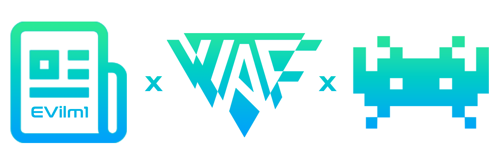
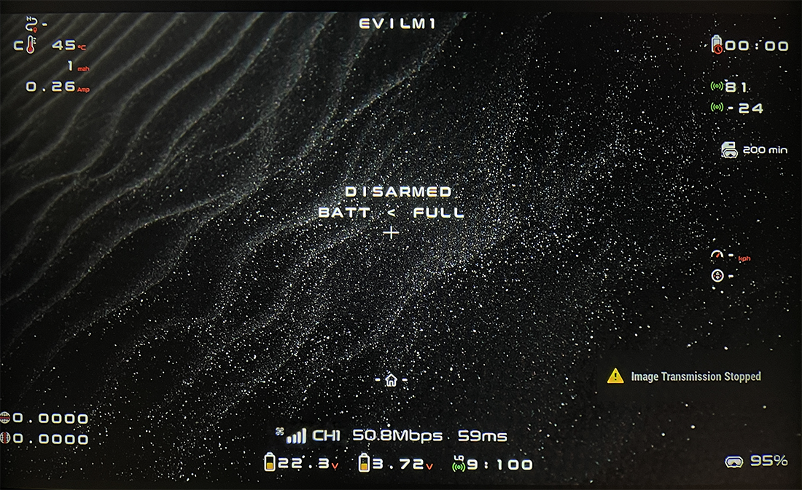

<a name="readme-top"></a>

[](https://discord.gg/4q5srBqn89)
[](https://code.visualstudio.com/)
[](https://www.python.org/downloads)
[](https://www.adobe.com/fr/products/photoshop.html)
[](https://forum.xda-developers.com/)
[]()

<!-- PROJECT LOGO -->
<br />
<div align="center">
  <a href="https://github.com/EVilm1/WIKI-HACK-DJI-OSD/blob/main/README.md">
    
  </a>

  <h3 align="center">WIKI HACK DJI OSD</h3>

  <p align="center">
    <a href="https://github.com/EVilm1/WIKI-HACK-DJI-OSD/blob/main/README_FR.md"><strong>Version Française ICI</strong></a><br />
    ✨ Customize your OSD ✨<br />
    <br />
    <a href="https://github.com/fpv-wtf/wtfos"><strong>Wiki WTFOS</strong></a>
    ·
    <a href="https://github.com/fpv-wtf/msp-osd"><strong>Wiki MSP-OSD</strong></a>
    ·
    <a href="https://fpv.wtf/"><strong>WTFOS Configurator</strong></a>
  </p>
</div>

<!-- TABLE OF CONTENTS -->
<details>
  <summary>Table of Contents</summary>
  <ol>
    <li><a href="#intro">Intro</a>
      <ul>
        <li><a href="#example">Example</a></li>
      </ul>
    </li>
  </ol>
  <ol>
    <li><a href="#1-install-wtfos">Install WTFOS</a>
      <ul>
        <li><a href="#configure-ports">Configure ports</a></li>
      </ul>
    </li>
    <li><a href="#2-move-elements-of-msp-osd">Move elements of MSP-OSD</a></li>
    <li><a href="#3-fakehd">FakeHD</a></li>
      <ul>
        <li><a href="#enable-and-configure-fakehd">Enable and configure FakeHD</a></li>
      </ul>
    </li>
    <li><a href="#4-splashscreen--screensaver-wtfos">Splashscreen & Screensaver WTFOS</a></li>
    <li><a href="#5-msp-osd-fonts">MSP-OSD Fonts</a></li>
    <li> <a href="#6-advanced-setup-modify-the-dji-hud-elements">(Advanced config): Modify the DJI HUD elements</a>
      <ul>
        <li><a href="#move-the-dji-hud-elements">Move the DJI HUD elements</a></li>
          <ul>
            <li><a href="#python-script-to-preview">Python script to preview</a></li>
            <li><a href="#edit-the-xml-file">Edit the .xml file</a></li>
          </ul>
        <li><a href="#change-the-font-of-the-dji-hud">Change the font of the DJI HUD</a></li>
        <li><a href="#change-the-dji-hud-icons">Change the DJI HUD icons</a></li>
      </ul>
    </li>
    <li><a href="#7-advanced-config-generate-your-own-font-for-msp-osd">(Advanced config): Generate your own Font for MSP-OSD</a></li>
    <li><a href="#sources--credits">Sources / Credits</a></li>
  </ol>
</details>

<!-- INTRO -->
# Intro

This documentation explains in detail how to modify your OSD in your DJI Googles.
The following examples will be made with the **DJI Googles V2 / Betaflight 4.4** combo. Works perfectly on Betaflight **4.4** with HD osd.<br />

In order to understand, it is necessary to establish the basics, it is necessary to differentiate the following terms:
* **``OSD Betaflight:``** This is the classic osd at the output of Betaflight, it is the one usually found in analog goggles.
* **``HUD DJI / CUSTOM OSD:``** Like the Betaflight osd, but interpreted by DJI, this is the default osd for DJI Googles. This feature is also called "Custom OSD" in the googles settings and is flawed because it does not use 100% of the information received from Betaflight. Some elements are modifiable (those coming from betaflight) others not (ex: googles battery)
* **``WTFOS MSP-OSD:``** The MSP-OSD package is installed through the WTFOS hack, it replaces the DJI HUD and allows new features.

<!-- EXEMPLE -->
## Example

We are going to make a mix between **``MSP-OSD``** for all the information at the output of Betaflight and the **``HUD DJI``** for all the other information which do not leave Betaflight (Ex: The battery of the googles, the quality of the VTX link, the VTX latency...)

We will also see how to change the location of the DJI HUD elements, change the DJI HUD font, create a new font for MSP-OSD... 

Here is a before/after example of what it is possible to do:<br />
| Before (**MSP-OSD only**) | After (**MSP-OSD + FakeHD + Custom HUD DJI + Custom Fonts**) |
|-------|-------|
|||

A video example (the DJI HUD has been added on the video for the example) :<br />

https://user-images.githubusercontent.com/51506790/208981180-be9528f5-7118-47d3-8a71-b43425f159c6.mp4

ℹ️ The info here is from my own experience, all <a href="#readme-top">sources</a> are quoted at the top or bottom of the doc.<br />
⚠️ The manipulations can involve risks (tiny if correctly done), you are the only ones responsible for the actions on your material.

<!-- INSTALL WTFOS -->
# 1. Install WTFOS

Before any manipulation, the googles have to be rooted, for that **WTFOS** has to be installed with [WTFOS-Configurator](https://fpv.wtf/), everything is very well explained in [the official doc](https://github.com/fpv-wtf/wtfos) of fpv-wtf. I advise you to look for tutorials on Youtube.

|||
|-------|-------|

⚠️ **IMPORTANT:** Before rooting the googles, make sure that the googles and the VTX (Vista/AirUnit) are in the same version.<br />

The software [DJI Assistant 2 FPV](https://www.dji.com/fr/downloads/softwares/dji-assistant-2-dji-fpv-series) allows you to check the version, upgrade or downgrade the firmware of the googles and the VTX. The version **``v01.00.06.06``** known as **``"606"``** is the most used and the one that fits best. I did not test with other versions, it can work, the version ``606`` is just the most used, you can test...


<!-- SERIALPORTS CONFIG -->
## Configure ports

Once the googles is rooted, you need to configure the ports on Betaflight. As the method has changed between Betaflight 4.3 and 4.4, I invite you to have a look at the official fpv-wtf github : [Flight Controller Setup](https://github.com/fpv-wtf/msp-osd#flight-controller-setup)

<!-- MOVE MSP-OSD -->
# 2. Move elements of MSP-OSD

Once **MSP-OSD** is installed (with ports configured on Betaflight) we can now disable the "Custom OSD" of the DJI googles in :
```
Settings > Display > Custom OSD : off
```
We now have the full OSD of Betaflight unlocked. We can add / remove / change the location of elements directly from the "OSD" section in Betaflight :


We note that the Betaflight OSD is necessarily in a 4:3 format. No matter what format you have chosen for your VTX (4:3 or 16:9) Betaflight cannot display an OSD wider than 4:3. For this there is a solution called ``FakeHD`` thanks to WTFOS which we will describe in detail in the next section.

<!-- FAKEHD -->
# 3. FakeHD

``FakeHD`` is a solution to display our OSD in a 16:9 format. To understand how to set it up you need to understand how it works:<br/>
The Betaflight OSD is a grid of 30 rows and 16 columns. It is impossible to "add" cells to stretch the 4:3 format to a 16:9 format. To get around this problem, ``FakeHD`` allows to move "blocks" of the 4:3 format to make a 16:9 format.<br/>
Explanations not very clear, simpler scheme :

| Before (in Betaflight Configurator) | After with ``FakeHD`` (in the googles) |
| -------|-------|
|||

On the scheme you can see the colored cells moved to the corners and sides, but there are also completely white cells. As mentioned above, it is impossible to "add" cells, so these cells are empty and it is impossible to display characters in the white areas.

A simple example to better understand :
| I display the "Warnings" element of Betaflight badly centered like this:  | ``FakeHD`` Result |
| -------|-------|
|||

This is a bit odd and should be taken into consideration when placing elements in Betaflight.<br/>
For more info and settings please visit the [official FakeHD doc](https://github.com/fpv-wtf/msp-osd#fakehd).

<!-- INSTALL FAKEHD -->
## Enable and configure **FakeHD**

To activate ``FakeHD``, connect the googles to WTFOS [Configurator](https://fpv.wtf/), in the ``CLI`` run :

```
package-config set msp-osd fakehd_enable true
package-config apply msp-osd
```
That's it ``FakeHD`` is enabled!<br/>

Unfortunately it would be too simple, because of the example of the cut text seen just before, the end of flight screen (the stats) cannot be displayed correctly. To correct this, ``FakeHD`` is able to turn on for the flight and turn off for the end screen thanks to a "character switch" (If the character is displayed on the screen then ``FakeHD`` turns on, otherwise it turns off).<br/>
This "character switch" is set by default on the character "Throttle Position". If you don't want to display this character or want to change it, I let you read [the doc](https://github.com/fpv-wtf/msp-osd#menu-switching---getting-rid-of-gaps-when-displaying-menu--post-flight-stats--displaying-centered) which explains it very well.
Personally, I use the crosshair icon (number 115) [in the doc again!](https://github.com/betaflight/betaflight/blob/master/docs/osd.md)

<!-- WTFOS SPLASHSCREEN -->
# 4. Splashscreen & Screensaver WTFOS
Thanks to WTFOS we can change the default background screen of the DJI googles. For this we need to have installed in the [WTFOS-Configurator](https://fpv.wtf/) the packages ``image-changer`` and ``image-configurator`` :


Then we can keep the WTFOS background or add a custom background named ``splashscreen.png`` to be placed at the root of the SD card of the DJI googles.
The optimal format is ``1920x1080``. The larger the image, the slower your googles will start!

<!-- MSP-OSD FONTS -->
# 5. MSP-OSD Fonts

It is possible to change the font of the MSP-OSD (be careful to distinguish it from the DJI HUD).<br/>
The font files consist of 4 .bin files to be placed at the root of the SD card of the DJI googles. These files will be read automatically when the goggles start up.<br/>
In our example with Betaflight I have : ``font_bf.bin``, ``font_bf_2.bin``,	``font_bf_hd.bin`` and ``font_bf_hd_2.bin``.<br/>
If ``FakeHD`` is not installed, you need all 4 files, otherwise the last two are sufficient.

There are several fonts already created (by me or other very nice users) :

 - [EVilm1's font](https://github.com/EVilm1/EVilm1-OSD-Font)
 - [KNIFA's Material](https://github.com/Knifa/material-osd)
 - [Shannon Baker](https://drive.google.com/drive/folders/1buxrXqhU46AxE3fwaFDsMb97IiGLVa95)
 - [SNEAKY_FPV's colour fonts for INAV, ARDU and BF](https://sites.google.com/view/sneaky-fpv/home)
 - [VICEWIZE Italic](https://github.com/vicewize/vicewizeosdfontset)

For a different configuration or more parameters see the [official MSP-OSD doc](https://github.com/fpv-wtf/msp-osd#choose-a-font).
It is also possible to generate your own font (advanced) which will be detailed a bit lower in this doc.

<!-- MOVE HUD DJI -->
# 6. (Advanced Setup) Modify the ``DJI HUD`` elements

⚠️ This part consists of modifying the internal configuration files of the DJI googles, needless to say that you should proceed with **EXTREME CAUTION**.
Reserved for users with a minimum of experience on a terminal. **Do not execute any command that you do not understand**. ⚠️

ℹ️ Accessing the configuration files requires the googles to be rooted.

To access the internal files we will use the Android development tools ``ADB and Fastboot``.
For the simplicity I advise you [Minimal ADB and Fastboot](https://androidmtk.com/download-minimal-adb-and-fastboot-tool) which is a light version but integrates all the functions we need. Here is a possible [list of commands](https://www.android-mt.com/tutoriel/liste-des-commandes-adb-et-fastboot-loutil-indispensable-du-super-utilisateur-android/74897/).<br/>

Connect DJI goggles to the PC.<br/>
Start ``Minimal ADB and Fastboot``. Run :
```
adb start-server
```
Then, to display the recognized devices, run :
```
adb devices
```
You should get this result:
```
List of devices attached
XXXXXXXXXABCDEF device
```
If no devices are displayed, make sure the serial port is not already occupied by WTFOS-Configurator or Betaflight open in background.<br/>

For security reasons, we will make a backup of the directory where we will modify the files. Run :
```
adb pull system/ [target]
```
Replace ``[target]`` with the target folder on your computer where the backup will be copied.
Once the backup is done, go to the next step.

## Move the ``DJI HUD`` elements
The position of the ``DJI HUD`` elements is defined in X and Y in the file named ``racing_chnl_osd_win.xml`` located in ``/system/gui/xml/``.<br/>
We download the file to modify it locally. Run:
```
adb pull /system/gui/xml/racing_chnl_osd_win.xml [target]
```
We can also recover this file from the backup but it is better not to touch the folder for safety reasons to keep the original file.
Once the file is downloaded, open it with your favorite code editor.

### Python script to preview
To help us visualize the googles elements virtually we can use the python script of [Druckgott](https://github.com/druckgott/dji_stuff/tree/581dcb42ac6aa2f282d7b5c5085d97d4312492bd). Download the ZIP containing ``show_xml.py`` from its main page and then unzip the file in the same directory as ``racing_chnl_osd_win.xml``.<br/>
Download and install the latest version of python [here](https://www.python.org/downloads/).<br/> To run the python file, open a terminal or Powershell, navigate to the directory containing ``show_xml.py`` then run :
```
python.exe show_xml.py -i racing_chnl_osd_win.xml
```
(If it asks you to install other modules like "pillow" or other accept and install)<br/>
A visualization window appears:


We can click in the window to know the position in px of the cursor.<br/>
To update this window, close it and run the command again.

### Edit the ``.xml`` file

As we can see in the preview, the elements are displayed in "blocks". 
Here is an example with the googles battery named ``gs_voltage`` placed in the ``racing_gs_voltage_win`` block having itself a positon (``dx`` and ``dy``), a size (``w`` and ``h``) and an anchor point (``alignment``).


We can change this position, the size or the anchor point (represented by a red dot in the preview).<br/>
Save the file, then refresh the preview ``show_xml.py`` to see the changes.

ℹ️ We can note the presence of an icon named ``gs_battery_icon`` and a ``gs_voltage`` parameter named ``font.name`` which will be detailed later in this doc.

ℹ️ The XML file I modified and used in the examples at the beginning of the doc is available [here](https://github.com/EVilm1/WIKI-HACK-DJI-OSD/blob/main/racing_chnl_osd_win.xml). (Be careful, I modified some fonts, you have to use the same fonts otherwise it won't work) and to change the fonts of the DJI HUD it's [here](https://github.com/EVilm1/WIKI-HACK-DJI-OSD#change-the-font-of-the-dji-hud)

Finally, once the changes are done, to upload ``racing_chnl_osd_win.xml`` in the googles, with ``ADB`` run :
```
adb push [target]/racing_chnl_osd_win.xml /system/gui/xml/
```
Replace [target] with the directory containing your ``.xml`` file.<br/>
(This will overwrite ``racing_chnl_osd_win.xml`` present on the googles, so the backup is important)

Restart the googles to apply the changes. You can use :
```
adb reboot
```
⚠️ If two elements touch, if a block is incorrectly written or incomplete, then the element will not display or even the googles will fail to load the osd and may restart in a loop. 

ℹ️ *Many people have tried, as I did at my beginnings, to delete entire blocks of code or to modify the ``show="true"`` parameter to delete elements (like the battery voltage and the timer). **To save you time:** This does not work and makes the goggles restart in a loop. If you want to hide elements you can change their position to hide them "behind the edges" of the screen.*

## Change the font of the ``DJI HUD``

The font files are located in the folder: ``system/fonts``. The default font is ``WM150font.ttf``<br/>
It is now possible to copy a new font file in ``.ttf`` format only in the same folder.
In my setup, I used the [Conthrax](https://www.dafont.com/fr/conthrax.font?text=EVilm1%27s+Font) font which I also used in [the font I created](https://github.com/EVilm1/EVilm1-OSD-Font) for ``MSP-OSD``.<br/>

ℹ️ Do not rename the file ``.ttf`` otherwise it will not work and the googles will not succeed in loading the osd.

Finally, the ``font.name`` parameter in the ``racing_chnl_osd_win.xml`` file modified previously must be edited:


Save the file, upload it and restart the googles to apply the changes.

## Change the ``DJI HUD`` icons

The icons are located in the folder: ``system/gui/image``.<br/>
It is now possible to modify an icon by downloading it, modifying it using (precision) image editing software such as Adobe Photoshop or Gimp, and then uploading it to the googles in the same directory to overwrite the icon you wish to modify.<br/>

ℹ It is important to keep the same image extension and size (varies by icon).<br/>

Again in the ``racing_chnl_osd_win.xml`` file, here is the ``image.name`` parameter where the googles battery icon is set for example:


You can change the icons as you wish.

# 7. (Advanced config): Generate your own Font for ``MSP-OSD``

To generate a font, we use a ``.png`` image in ``576 x 1728`` format. Download the [mcm2img](https://github.com/Knifa/mcm2img/tree/templates) project from [Knifa](https://github.com/Knifa) on GitHub.<br/>
To create our OSD we use a template grid.

To generate a template grid, go to the root of the folder and execute ``template_overlay.py`` with python :
```
python3 template2img.py template.png
```
An image ``template_overlay.png`` has been generated at the root of the folder.<br/>
Open the generated image with your favorite editing software (I use Photoshop but Gimp works too).<br/>
I created a Photoshop file ``template_overlay.psd`` using the ``template_overlay.png`` file (with extra markers) which you can download [here](https://github.com/EVilm1/WIKI-HACK-OSD-DJI/blob/master/template_overlay.psd) if you use Photoshop.<br/><br/>


To know where to place the icons in the grid, we can use the classic Betaflight fonts [here](https://github.com/betaflight/betaflight-configurator/tree/master/resources/osd/2) or HD fonts like [EVilm1's font](https://github.com/EVilm1/EVilm1-OSD-Font) or [other HD fonts](https://github.com/EVilm1/WIKI-HACK-DJI-OSD#5-msp-osd-fonts).

Export the image always in ``.png`` format ``576 x 1728`` with an alpha background (transparent).<br/>

To convert the image in 4 files ``.bin``, execute with python (replacing the name of your image) :<br/>
```
python3 template2img.py [NameOfYourImage].png
```
4 files ``.bin`` have been generated in the root of the folder. Rename them to ``font_bf.bin``, ``font_bf_2.bin``, ``font_bf_hd.bin`` and ``font_bf_hd_2.bin`` (for Betaflight only).
Finally, use only ``font_bf_hd.bin`` and ``font_bf_hd_2.bin`` if [FakeHD](https://github.com/EVilm1/WIKI-HACK-DJI-OSD#3-fakehd) is installed, otherwise all 4.

**A quality OSD takes time, good luck !**

## Sources / Credits

https://github.com/fpv-wtf<br/>
https://github.com/Knifa<br/>
https://github.com/druckgott<br/>
Thanks to [Sneaky-fpv](https://sites.google.com/view/sneaky-fpv/home),<br/>
Thanks to Motard Geek and his [article](https://www.wearefpv.fr/tuto-wtfos-hack-dji-full-osd-20221130/),<br/>
Thanks to [Joshua Bardwell](https://www.youtube.com/@JoshuaBardwell) for his videos ;p

If you have any suggestions or questions do not hesitate : [issues](https://github.com/EVilm1/WIKI-HACK-DJI-OSD/issues) or ``@evilm1`` on Discord.<br/>
**If this doc helped you and you liked it, you can buy me a coffee 😉 :** https://www.buymeacoffee.com/evilm1

<p align="right"><a href="#readme-top">[back to top]</a></p>
